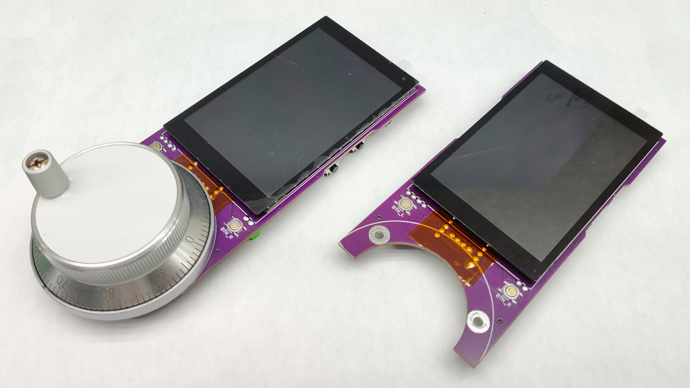
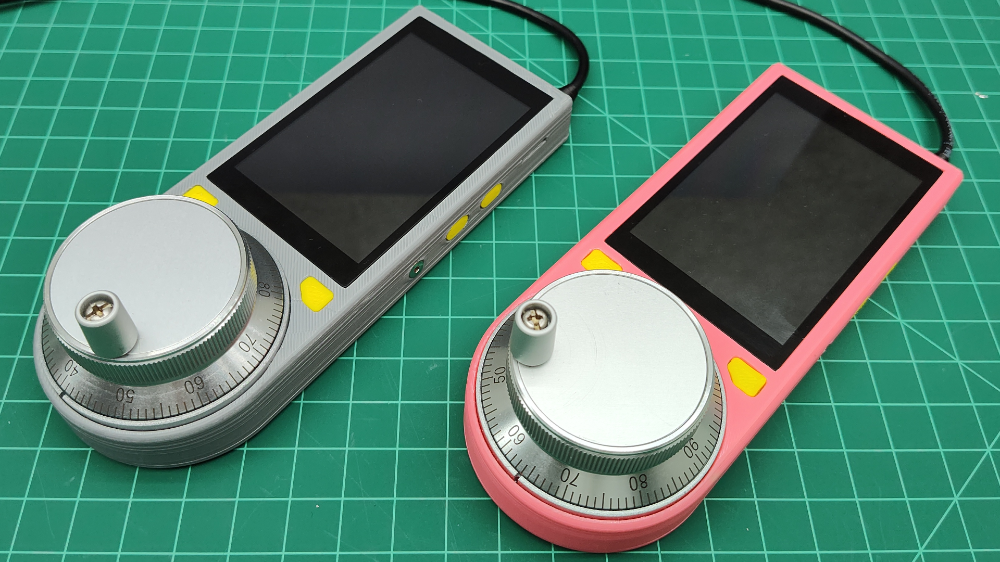
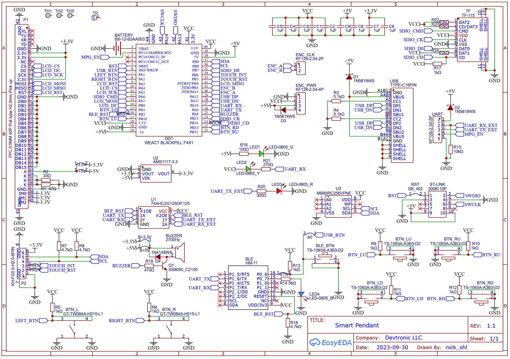

# Devtronic SmartPendant

This project allow to control grblHAL based CNC machine withot PC. It also make work way more convinient.

**Store:** https://devtronic.square.site/

# PCB files

https://oshwlab.com/nick_shl/smart_pendant

# Parts

To make this project yourself, you will need this essential parts:

* [WeAct BlackPill F411 25M HSE:](https://s.click.aliexpress.com/e/_DC6TlGd)

* One of this displays:
  [3.5" Display with touchscreen based on ILI9488 LCD controller and FT6236 touch controller](https://www.aliexpress.us/item/3256804935586911.html) - select option ILI9488 FT6236
  [3.5" Display with touchscreen based on ILI9488 LCD controller and FT6236 touch controller](https://www.aliexpress.us/item/3256801122874433.html) - select option ILI9488 FT6236 or IPS ILI9488 FT6236(in my opinion regular looks better)
  [3.5" Display with touchscreen based on ILI9488 LCD controller and FT6236 touch controller](https://www.aliexpress.us/item/3256803764398718.html) - select option ILI9488 FT6236 or IPS ILI9488 FT6236(in my opinion regular looks better)

* [60 mm 6 pin 100 PPR handwheel](https://s.click.aliexpress.com/e/_DCFuJHr)

## Case

3D_Print folder of this repo contain 3D files(OpenSCAD and STLs) of the case. 

## Dimensions

**160** mm x **65** mm x **20** mm (55 mm with handwheel and handle)
Approx. 6-3/8" x 2-5/8" x 3/4"

## Schematic

## Firmware

Source code can be [found there](https://github.com/nickshl/SmartPendant)

