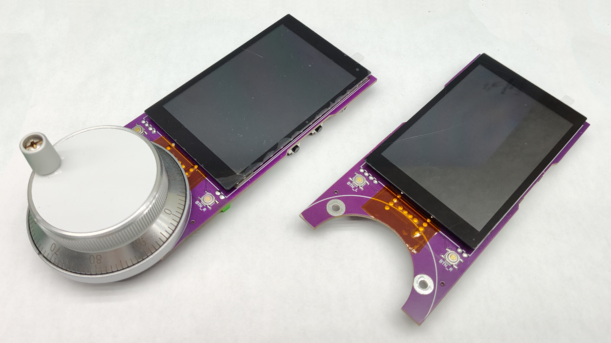
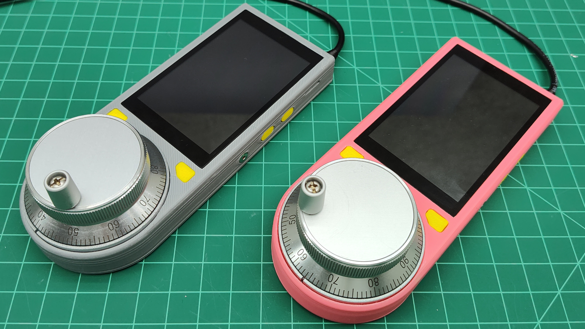
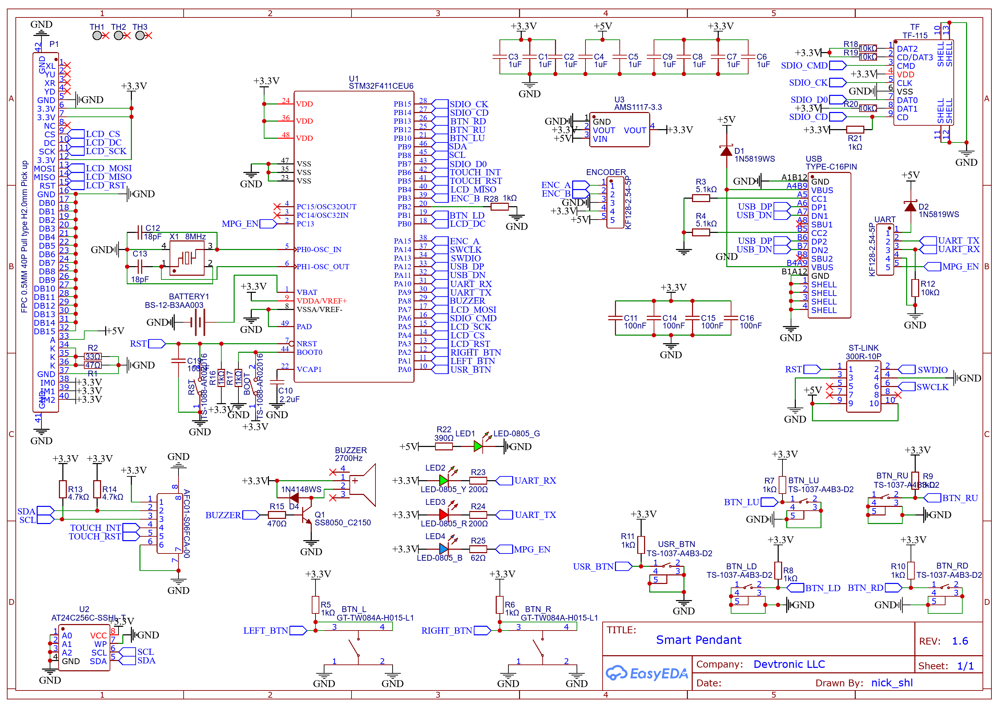
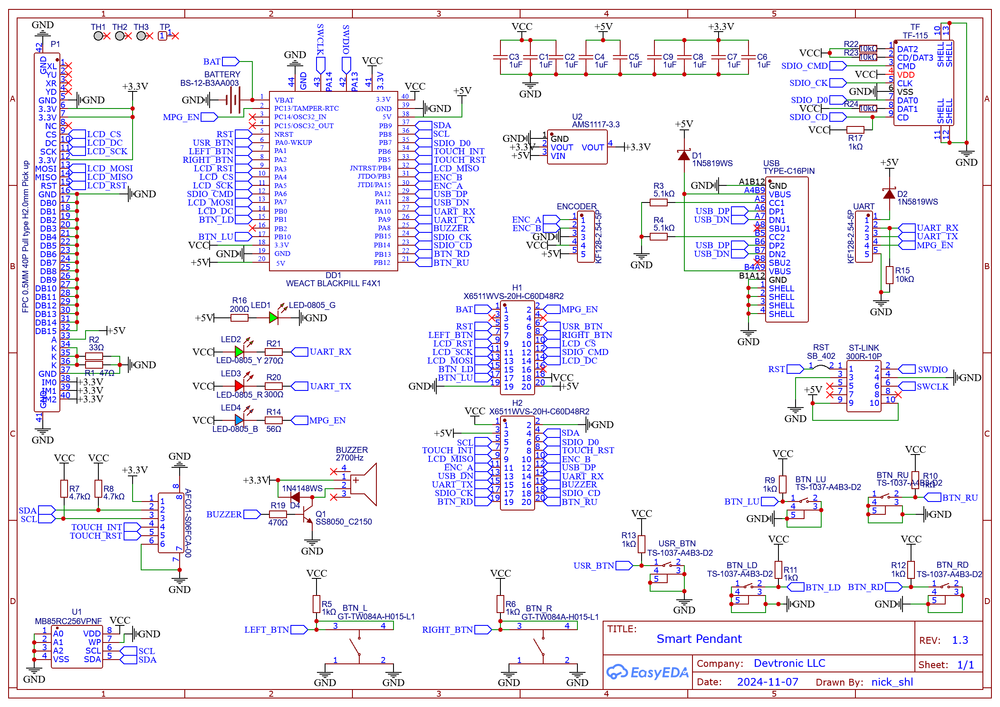
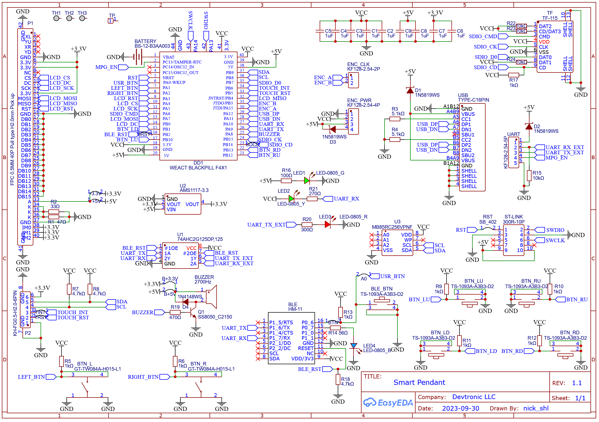

# Devtronic SmartPendant

This project allow to control grblHAL based CNC machine withot PC. It also make work way more convinient.

**Store:** https://devtronic.square.site/

# Case versions

Version that includes "Raft" in the name has solid first layer, all openings have to be open with a knife.
This gives more uniform surface. For front part print it recommended to turn on tree support for encoder opening.

Cable relief should be printed with TPU. After the print, groove have to be opened by cutting and pulling the material.
Cable relief designed for 4 mm cable. If your cable is different - generate new one, function CableReliefCircular(X) accept cable diameter in mm.

# Firmware

Source code for this project can be found there: **https://github.com/nickshl/SmartPendant**

Latest firmware placed in Release folder: [SmartPendant.hex](https://github.com/nickshl/SmartPendant/blob/main/Release/SmartPendant.hex)

To load new firmware [STM32CubeProgrammer](https://www.st.com/en/development-tools/stm32cubeprog.html) is used.
Connect SmartPendant to PC using USB-C cable. Press and hold BOOT0 button, then short press NRST button, couple seconds later BOOT0 button can be released.
Open STM32CubeProgrammer. In top right corner choose "USB" from drop down list.
If field "Port" in "USB Configuration" show "No DFU detected" click update button near it.
Click "Connect" button - STM32CubeProgrammer should establish connection and show current device memory content.
Click "Open File" in left to corner, select firmware HEX file, then click "Download" button in top left corner.
When flashing is done, close STM32CubeProgrammer and short press NRST button on the Controller to restart it. 

**Note:** if flashing is successful, but firmware isn't work, check STM32CubeProgrammer log. If it says "sector 0000 does not exist" erasing operation wasn't successful and new firmware "merged"(write operation can only flip bits from 1 to 0) with old one. To fix this issue, press "eraser" button in bottom right corner and click "Ok" button in pop up window. After erasing is finished "Device memory" should show only FFFFFFFF. Flash new firmware after that. 

# PCB files

Files for PCB version 1.5a can be found in PCB folder which contains Gerber, BOM and Pick and Place files, as well as EasyEDA schematic and PCB json files.

# Parts

To make this project yourself, you will need this essential parts:

* [WeAct BlackPill F411 8M HSE:](https://s.click.aliexpress.com/e/_DC6TlGd)
Note: 25m will work too, but may have problems with entering in bootloader with BOOT button. In this case try to heat up MCU with hair dtyer before trying to enter bootloader mode. If board is programmed, bootload mode can be access by holding MPG button diring power cycle.

* One of this displays:
  [3.5" Display with touchscreen based on ILI9488 LCD controller and FT6236 touch controller](https://www.aliexpress.us/item/3256804935586911.html) - select option ILI9488 FT6236
  [3.5" Display with touchscreen based on ILI9488 LCD controller and FT6236 touch controller](https://www.aliexpress.us/item/3256801122874433.html) - select option ILI9488 FT6236 or IPS ILI9488 FT6236(in my opinion regular looks better)
  [3.5" Display with touchscreen based on ILI9488 LCD controller and FT6236 touch controller](https://www.aliexpress.us/item/3256803764398718.html) - select option ILI9488 FT6236 or IPS ILI9488 FT6236(in my opinion regular looks better)

* [60 mm 6 pin 100 PPR handwheel](https://s.click.aliexpress.com/e/_DCFuJHr)

* [5x5x1.5mm Momentary Panel PCB Surface Mounted Devices SMT Mount 4 Pins Push Button SPST Tactile Tact Switch](https://s.click.aliexpress.com/e/_c3amv5Ub)

* [805 SMD LEDs: green, yellow, red and blue](https://s.click.aliexpress.com/e/_c3RvuM13)

# Case

3D_Print folder of this repo contain 3D files(OpenSCAD and STLs) of the case. 

## Dimensions

**160** mm x **65** mm x **20** mm (55 mm with handwheel and handle)
Approx. 6-3/8" x 2-5/8" x 3/4"

# Schematic

Schematic vesion 1.6:

Schematic vesion 1.3:

Schematic vesion 1.1:

# Firmware

Source code and rady to load firmware can be [found there](https://github.com/nickshl/SmartPendant)

# Off the shelf version

It is a possible to assemble pendant from off the helf components with lot of soldering by using this display:

[3.5-inch TFT LCD Module Serial Port SPI Drive ILI9488 with capacitive Touch RGB320 * 480](https://www.aliexpress.us/item/3256804935586911.html)

File SmartPendant_off-the-shelf.scad have code to generate case that was used during prototype stage.

# Assembly instructions videos

English:

Russian:

# Support

If you really like what I do and want to support my effort, you can do it using this links:

https://github.com/sponsors/nickshl

https://paypal.me/nickshl
